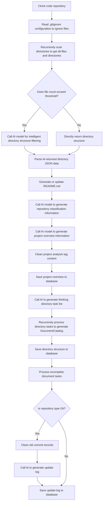

# OpenDeepWiki

[中文](README.zh-CN.md) | [English](README.md)

<div align="center">
  
  <h3>AI-Driven Code Knowledge Base</h3>
</div>

---

# enterprise service

[Pricing of enterprise services](https://docs.opendeep.wiki/pricing)

Our enterprise service offers comprehensive support and flexibility for businesses seeking professional AI solutions.

---

# Features

- **Quick Conversion**: Supports converting all GitHub, GitLab, AtomGit, Gitee, Gitea and other code repositories into knowledge bases within minutes.
- **Multi-language Support**: Supports code analysis and documentation generation for all programming languages.
- **Code Structure Diagrams**: Automatically generates Mermaid diagrams to help understand code structure.
- **Custom Model Support**: Supports custom models and custom APIs for flexible extension.
- **AI Intelligent Analysis**: AI-based code analysis and code relationship understanding.
- **SEO Friendly**: Generates SEO-friendly documentation and knowledge bases based on Next.js for easy search engine crawling.
- **Conversational Interaction**: Supports conversations with AI to obtain detailed code information and usage methods for deep code understanding.

---

# Feature List

- [x] Support multiple code repositories (GitHub, GitLab, AtomGit, Gitee, Gitea, etc.)
- [x] Support multiple programming languages (Python, Java, C#, JavaScript, etc.)
- [x] Support repository management (CRUD operations on repositories)
- [x] Support multiple AI providers (OpenAI, AzureOpenAI, Anthropic, etc.)
- [x] Support multiple databases (SQLite, PostgreSQL, SqlServer, MySQL, etc.)
- [x] Support multiple languages (Chinese, English, French, etc.)
- [x] Support uploading ZIP files and local files
- [x] Provide data fine-tuning platform to generate fine-tuning datasets
- [x] Support directory-level repository management with dynamic directory and document generation
- [x] Support repository directory modification management
- [x] Support user management (CRUD operations on users)
- [x] Support user permission management
- [x] Support repository-level generation of different fine-tuning framework datasets

---

# Project Introduction

OpenDeepWiki is an open-source project inspired by [DeepWiki](https://deepwiki.com/), developed based on .NET 9 and Semantic Kernel. It aims to help developers better understand and utilize code repositories, providing features such as code analysis, documentation generation, and knowledge graph construction.

Main Features:

- Analyze code structure
- Understand repository core concepts
- Generate code documentation
- Automatically generate README.md for code
- Support MCP (Model Context Protocol)

---

# MCP Support

OpenDeepWiki supports the MCP protocol:

- Can serve as a single repository MCPServer for repository analysis.

Example configuration:

```json
{
  "mcpServers": {
    "OpenDeepWiki":{
      "url": "http://Your OpenDeepWiki service IP:port/api/mcp?owner=AIDotNet&name=OpenDeepWiki"
    }
  }
}
```

If mcp streamable http is not supported, use the following format: 
```json

{
  "mcpServers": {
    "OpenDeepWiki":{
      "url": "http://Your OpenDeepWiki service IP:port/api/mcp/sse?owner=AIDotNet&name=OpenDeepWiki"
    }
  }
}
```

**MCP Streamable Configuration**

You can configure MCP streamable support for specific services using the `MCP_STREAMABLE` environment variable:

```yaml
environment:
  # Format: serviceName1=streamableUrl1,serviceName2=streamableUrl2
  - MCP_STREAMABLE=claude=http://localhost:8080/api/mcp,windsurf=http://localhost:8080/api/mcp
```

This allows you to specify which services should use streamable HTTP endpoints and their corresponding URLs.

- owner: Repository organization or owner name
- name: Repository name

After adding the repository, you can test by asking questions like "What is OpenDeepWiki?", with effects as shown below:


This way, OpenDeepWiki can serve as an MCPServer for other AI models to call, facilitating analysis and understanding of open-source projects.

---

# 🚀 Quick Start

## Prerequisites

- [Docker](https://docs.docker.com/get-docker/) and Docker Compose installed
- An API key from an OpenAI-compatible LLM provider

## 1. Clone the repository

```bash
git clone https://github.com/AIDotNet/OpenDeepWiki.git
cd OpenDeepWiki
```

## 2. Configure environment variables

Edit `compose.yaml` and fill in your AI provider settings. At minimum, set these variables:

```yaml
services:
  opendeepwiki:
    environment:
      # AI Chat (used for conversational features)
      - CHAT_API_KEY=sk-xxx              # Your API key
      - ENDPOINT=https://api.openai.com/v1
      - CHAT_REQUEST_TYPE=OpenAI         # OpenAI | AzureOpenAI | Anthropic

      # Wiki generator - catalog generation
      - WIKI_CATALOG_MODEL=gpt-4o
      - WIKI_CATALOG_API_KEY=sk-xxx
      - WIKI_CATALOG_ENDPOINT=https://api.openai.com/v1
      - WIKI_CATALOG_REQUEST_TYPE=OpenAI

      # Wiki generator - content generation
      - WIKI_CONTENT_MODEL=gpt-4o
      - WIKI_CONTENT_API_KEY=sk-xxx
      - WIKI_CONTENT_ENDPOINT=https://api.openai.com/v1
      - WIKI_CONTENT_REQUEST_TYPE=OpenAI
```

> All three key groups (CHAT, WIKI_CATALOG, WIKI_CONTENT) can share the same API key and endpoint.

## 3. Build and start

```bash
# Build all images and start in background
docker compose build
docker compose up -d
```

Or use the Makefile shortcut:

```bash
make build   # Build all Docker images
make up      # Start all services (detached)
```

## 4. Access the application

| Service  | URL                    |
|----------|------------------------|
| Frontend | http://localhost:3000   |
| Backend API | http://localhost:8080 |

Default admin credentials: `admin@routin.ai` / `Admin@123`

## Database Configuration

SQLite is used by default with no extra setup. To use PostgreSQL, update `compose.yaml`:

```yaml
- DB_TYPE=postgresql
- CONNECTION_STRING=Host=your-host;Database=opendeepwiki;Username=postgres;Password=password
```

---

# Deployment Recommendations

Build for a specific architecture:

```bash
docker compose build --build-arg ARCH=arm64
docker compose build --build-arg ARCH=amd64
```

Build only backend or frontend:

```bash
docker compose build opendeepwiki
docker compose build web
```

One-click deployment to Sealos (supports public network access):

[](https://bja.sealos.run/?openapp=system-template%3FtemplateName%3DOpenDeepWiki)

For detailed steps, please refer to: [One-click Sealos Deployment of OpenDeepWiki](scripts/sealos/README.zh-CN.md)

---

# 🔍 How It Works

OpenDeepWiki leverages AI to achieve:

- Clone code repository locally
- Read .gitignore configuration to ignore irrelevant files
- Recursively scan directories to get all files and directories
- Determine if file count exceeds threshold; if so, call AI model for intelligent directory filtering
- Parse AI-returned directory JSON data
- Generate or update README.md
- Call AI model to generate repository classification information and project overview
- Clean project analysis tag content and save project overview to database
- Call AI to generate thinking directory (task list)
- Recursively process directory tasks to generate document directory structure
- Save directory structure to database
- Process incomplete document tasks
- If Git repository, clean old commit records, call AI to generate update log and save

---

# OpenDeepWiki Repository Parsing to Documentation Detailed Flow Chart



---

# Advanced Configuration

## Environment Variables

- `KOALAWIKI_REPOSITORIES`: Repository storage path
- `TASK_MAX_SIZE_PER_USER`: Maximum parallel document generation tasks per user for AI
- `CHAT_MODEL`: Chat model (must support function calling)
- `ENDPOINT`: API endpoint
- `ANALYSIS_MODEL`: Analysis model for generating repository directory structure
- `CHAT_API_KEY`: API key
- `LANGUAGE`: Document generation language
- `DB_TYPE`: Database type, supports sqlite, postgres, sqlserver, mysql (default: sqlite)
- `MODEL_PROVIDER`: Model provider, default OpenAI, supports AzureOpenAI, Anthropic
- `DB_CONNECTION_STRING`: Database connection string
- `EnableSmartFilter`: Whether to enable smart filtering, affects AI's ability to get repository directories
- `UPDATE_INTERVAL`: Repository incremental update interval (days)
- `MAX_FILE_LIMIT`: Maximum upload file limit (MB)
- `DEEP_RESEARCH_MODEL`: Deep research model, if empty uses CHAT_MODEL
- `ENABLE_INCREMENTAL_UPDATE`: Whether to enable incremental updates
- `ENABLE_CODED_DEPENDENCY_ANALYSIS`: Whether to enable code dependency analysis, may affect code quality
- `ENABLE_WAREHOUSE_COMMIT`: Whether to enable warehouse commit
- `ENABLE_FILE_COMMIT`: Whether to enable file commit
- `REFINE_AND_ENHANCE_QUALITY`: Whether to refine and enhance quality
- `ENABLE_WAREHOUSE_FUNCTION_PROMPT_TASK`: Whether to enable warehouse function prompt task
- `ENABLE_WAREHOUSE_DESCRIPTION_TASK`: Whether to enable warehouse description task
- `CATALOGUE_FORMAT`: Directory structure format (compact, json, pathlist, unix)
- `ENABLE_CODE_COMPRESSION`: Whether to enable code compression
- `CUSTOM_BODY_PARAMS`: Custom request body parameters, format: `key1=value1,key2=value2` (e.g., `stop=<|im_end|>,max_tokens=4096`). These parameters will be added to all AI model API requests
- `READ_MAX_TOKENS`: Maximum token limit for reading files in AI, prevents unlimited file reading. It is recommended to fill in 70% of the model's maximum token (default: 100000)
- `MAX_FILE_READ_COUNT`: Maximum file read count limit for AI, prevents unlimited file reading and improves processing efficiency (default: 10, 0 = no limit)
- `AUTO_CONTEXT_COMPRESS_ENABLED`: Whether to enable AI-powered intelligent context compression for long conversations (default: false)
- `AUTO_CONTEXT_COMPRESS_TOKEN_LIMIT`: Token threshold to trigger context compression. Required when compression is enabled (default: 100000)
- `AUTO_CONTEXT_COMPRESS_MAX_TOKEN_LIMIT`: Maximum allowed token limit, ensures the token limit doesn't exceed model capabilities (default: 200000)
- `UNDERSTAND_QUICKLY_TOKEN`: Optional GitHub PAT (`Repository dispatches: write` on `looptech-ai/understand-quickly` only). When set, OpenDeepWiki stamps `metadata.{tool, tool_version, generated_at, commit}` into the generated `graphify-out/graph.json` and fires a `repository_dispatch` so the [understand-quickly](https://github.com/looptech-ai/understand-quickly) registry resyncs the entry. Opt-in; default behavior is unchanged. See [`looptech-ai/uq-publish-action@v0.1.0`](https://github.com/looptech-ai/uq-publish-action) for the recommended CI step.

**Intelligent Context Compression Features:**
Uses **Prompt Encoding Compression** - an ultra-dense, structured format that achieves 90%+ compression while preserving ALL critical information.

**Compression Strategy:**
```
100 messages (50k tokens) → 1 encoded snapshot (3k tokens)
Compression ratio: 94% ✨
```

**What Gets Preserved (100%):**
- **System Messages**: All system-level instructions
- **Function Calls & Results**: Complete tool invocation history (preserves core behavior)
- **Recent Conversation**: Most recent 30% of messages in original form

**What Gets Encoded (Older Messages):**
Instead of selecting/deleting messages, older messages are compressed into an ultra-dense structured snapshot:

```markdown
## CONTEXT_SNAPSHOT
### FILES
✓ src/File.cs:modified(L:25-48) → README.md:pending

### TASKS
✓ Implement feature X ✓ Fix bug Y → Add tests (pending)

### TECH_STACK
IChatClient, Semantic Kernel, AutoContextCompress, TokenHelper

### DECISIONS
[D1] Use message filtering: preserve structure
[D2] Keep 30% recent: based on Google Gemini best practice

### CODE_PATTERNS
```cs
if (message.Contents.Any(c => c is FunctionCallContent)) { ... }
```

### USER_INTENT
Enable configurable compression via env vars. Must preserve core behavior.

### NEXT_ACTIONS
1. Update documentation 2. Add unit tests
```

**Encoding Format Features:**
- ✓ Ultra-dense: Uses symbols (✓=done, →=pending, ✗=blocked)
- ✓ Structured: 8 semantic sections (FILES, TASKS, TECH_STACK, etc.)
- ✓ Precise: Preserves file paths, line numbers, function names, decisions
- ✓ Actionable: Clear next steps for AI to continue work
- ✓ Lossless: All critical information encoded, zero loss

**Key Benefits:**
- ✅ 90-95% compression ratio (vs 30-40% with message filtering)
- ✅ Zero loss of function calls and results
- ✅ Maintains temporal context (recent messages untouched)
- ✅ AI can reconstruct full understanding from snapshot
- ✅ One snapshot replaces hundreds of messages
- `FeishuAppId`: Feishu App ID (required if enabling Feishu Bot)
- `FeishuAppSecret`: Feishu App Secret (required if enabling Feishu Bot)
- `FeishuBotName`: Feishu bot display name (optional)

---

# Feishu Bot Integration

- Purpose: Connect the current repository to Feishu group/DM as a knowledge bot for Q&A and content delivery.
- Callback route: `/api/feishu-bot/{owner}/{name}` (copy the full URL from the "Feishu Bot" button on the repository page).
- Requirement: Service must be publicly accessible; message encryption (Encrypt Key) is not supported yet.

## 1) Create an App in Feishu Open Platform

- Type: Internal App (for your organization).
- Capability: Enable "Bot". Publish to the organization and install it.
- Permissions (at minimum, per platform guidance):
  - Message send/read related scopes (e.g., `im:message`, `im:message:send_as_bot`).
  - Event subscription related scopes (for receiving message events).

## 2) Configure Event Subscriptions (Important)

- Open "Event Subscriptions" and disable "Encrypt Key".
- Subscribe to event: `im.message.receive_v1`.
- Request URL: `https://your-domain/api/feishu-bot/{owner}/{name}`.
  - `{owner}` is the repository organization or owner, e.g., `AIDotNet`.
  - `{name}` is the repository name, e.g., `OpenDeepWiki`.
- Save to complete the URL verification (backend already handles the challenge response).

Tip: You can also click the "Feishu Bot" button on the repository page to copy the dedicated callback URL.

## 3) Configure Server Environment Variables

Set the following in your backend service (see docker-compose example below):

- `FeishuAppId`: Feishu App ID
- `FeishuAppSecret`: Feishu App Secret
- `FeishuBotName`: Bot display name (optional)

## 4) Add the Bot to a Group and Use It

- After installing the app, add the bot to the target group.
- Group: @bot + your question (answers using the current repository's knowledge).
- Direct Message: send your question directly.
- Supports text and image replies (e.g., mind map images).

## Feishu FAQ

- No response/callback failed: ensure the Request URL is publicly reachable and that Nginx proxies `/api/` to the backend.
- "Encryption enabled" message: disable Encrypt Key (current version doesn't support encrypted messages).
- 403/insufficient permissions: make sure the app is installed in the org and required scopes/events are granted.

## Build for Different Architectures

Makefile commands:

```bash
make build-arm    # ARM architecture
make build-amd    # AMD architecture
make build-backend-arm   # Backend only ARM
make build-frontend-amd  # Frontend only AMD
```

---

# Community

- Discord: [join us](https://discord.gg/Y3fvpnGVwt)
- Feishu QR Code:


---

# 📄 License

This project is licensed under the MIT License. See [LICENSE](./LICENSE) for details.

---

# ⭐ Star History

[](https://www.star-history.com/#AIDotNet/OpenDeepWiki&Date)


